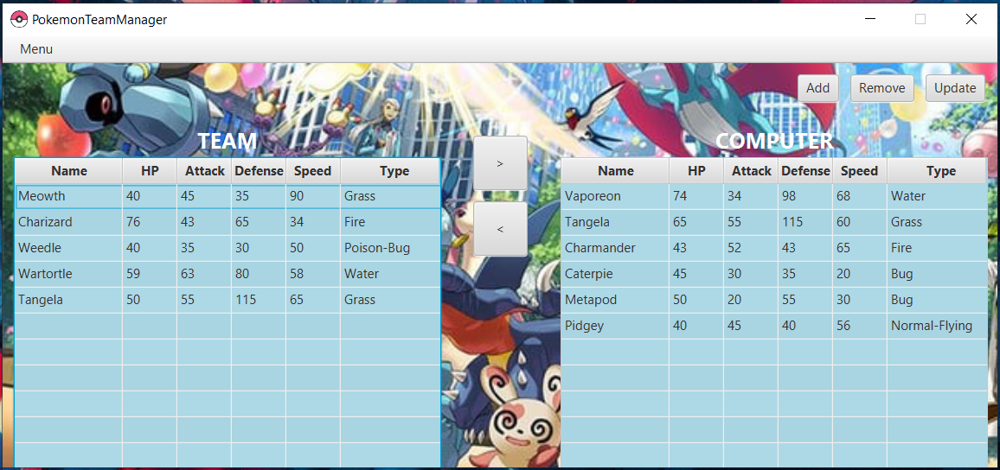
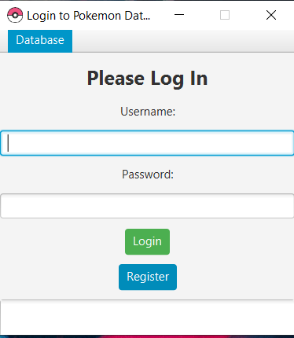

# PokemonTeamManager

Simple application to manage your pokemon team. Designed for project for college.

## Installation

-Install app in your desired location

-Installer automatically places the database file in C:\baza_pokemon

## Login panel

Login panel is just an example of how it may look like if I implemented accounts for each user.
For now everybody can make an account and log in.

Example login and password:
Login: student
Password: student

## Screenshots

